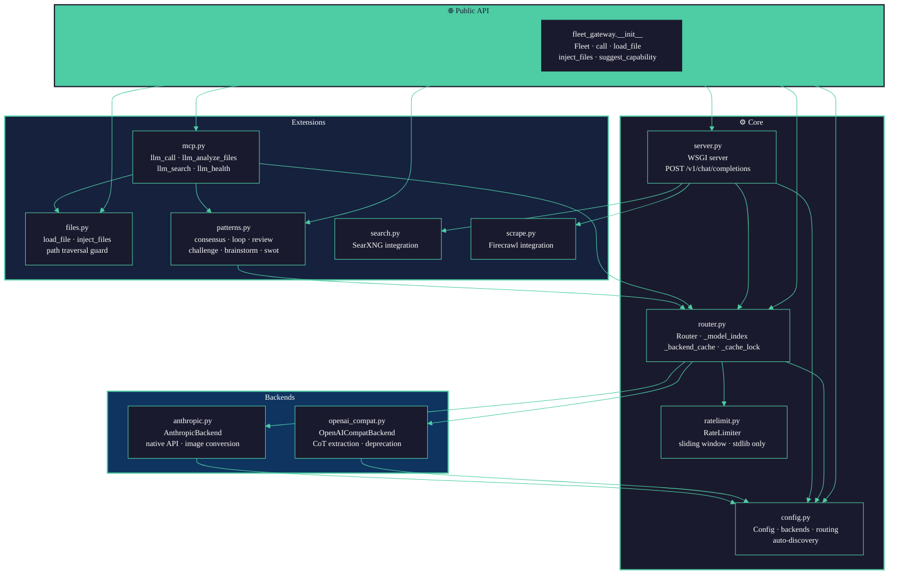

# Module Map

Python module dependencies and public API surface of fleet-gateway.



## Public API Surface

```python
from fleet_gateway import (
    Fleet,             # main class
    call,              # shortcut: call("coding", messages)
    load_file,         # load a file → OpenAI content block
    files_to_blocks,   # list of paths → list of blocks
    inject_files,      # inject blocks into last user message
    suggest_capability # "vision" / "coding" / "general" by file type
)
```

## Key Internal Contracts

| Interface | Contract |
|-----------|---------|
| `Router.call()` | Returns `str` or `None`; never raises on backend errors |
| `RateLimiter.acquire(timeout)` | Returns `True` (slot acquired) or `False` (timed out) |
| `Backend.call()` | Returns `str` or `None`; all exceptions caught internally |
| `inject_files()` | Returns new list; input `messages` is **never mutated** |
| `load_file()` | Raises `FileNotFoundError` or `ValueError` on bad input; caller decides |
