# Request Flow

End-to-end sequence for a single `POST /v1/chat/completions` call, showing rate limiting, circuit breaking, the fallback chain, and CoT normalization on success.

```mermaid
%%{init: {'theme': 'base', 'themeVariables': {
  'primaryColor': '#1a1a2e',
  'primaryTextColor': '#ffffff',
  'lineColor': '#4ecca3',
  'fontFamily': 'Inter, sans-serif',
  'fontSize': '13px',
  'activationBorderColor': '#4ecca3',
  'activationBkgColor': '#16213e',
  'noteBkgColor': '#0f3460',
  'noteTextColor': '#ffffff'
}}}%%
sequenceDiagram
    autonumber

    participant Client   as 🌐 Client<br/>(Python / curl / MCP)
    participant Gateway  as 🚪 Gateway<br/>(Router)
    participant RL       as ⏱ RateLimiter<br/>(per-backend)
    participant Backend  as ☁ Backend<br/>(LLM Provider)
    participant CoT      as 🧠 CoT Normalizer

    rect rgb(20, 40, 80)
        Note over Client,Gateway: Incoming request
        Client->>Gateway: POST /v1/chat/completions<br/>{ model: "coding", messages: [...] }
        Gateway->>Gateway: resolve capability → routing chain<br/>[ "groq/llama-3.3-70b", "gemini/...", ... ]
    end

    loop Fallback chain — try each entry until success

        rect rgb(10, 30, 60)
            Note over Gateway,RL: Rate limit check (non-blocking)
            Gateway->>RL: acquire_nowait(backend_name)

            alt Limit exceeded
                RL-->>Gateway: wait=Xs → skip this backend
            else Slot available
                RL-->>Gateway: ok — slot acquired
            end
        end

        rect rgb(10, 30, 60)
            Note over Gateway,Backend: Backend call
            Gateway->>Backend: POST /v1/chat/completions<br/>{ model, messages, max_tokens, ... }

            alt Success (HTTP 200)
                Backend-->>Gateway: { choices: [...] }

                rect rgb(5, 20, 50)
                    Note over Gateway,CoT: Chain-of-Thought normalization
                    Gateway->>CoT: extract content<br/>(content → reasoning → reasoning_content)
                    CoT->>CoT: strip think tags<br/>(<think>…</think>, unclosed tags)
                    CoT-->>Gateway: clean response text
                end

                Gateway-->>Client: 200 OK + response
                Note over Client,Gateway: Chain exits on first success

            else Failure (timeout / 5xx / null)
                Backend-->>Gateway: error
                Gateway->>Gateway: record failure — try next in chain
            end
        end

    end

    rect rgb(30, 10, 10)
        Note over Client,Gateway: All backends exhausted
        Gateway-->>Client: 503 Service Unavailable
    end
```

## Key Design Points

- **Non-blocking rate limiting** — `acquire_nowait()` returns immediately if a backend is at capacity; the router skips to the next entry rather than blocking the entire request.
- **No circuit breaker in package** — the production `fleet_gateway.py` in `_SHARED` has a per-backend `CircuitBreaker`; the open-source package uses only rate limiting + fallback.
- **CoT normalization priority** — `content` → `reasoning` (vLLM `--reasoning-parser`) → `reasoning_content` (Cogito/Apriel). Unclosed `<think>` tags are discarded entirely.
- **Thread safety** — `Router._backend_cache` and `_limiters` are protected by `_cache_lock` (double-checked locking). `RateLimiter` uses its own internal lock.
