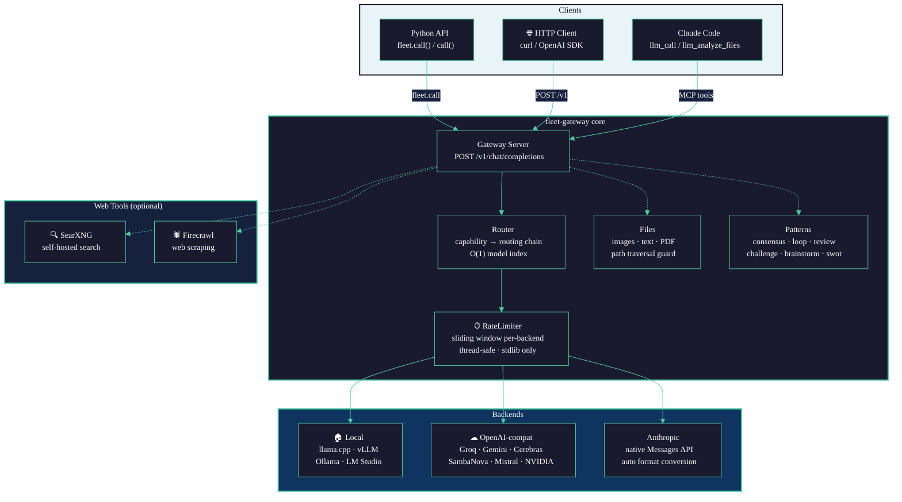

# System Overview

High-level map of every major component in fleet-gateway and how they connect.

> Solid arrows = primary request path. Dashed arrows = optional/auxiliary features.

## Component Descriptions

| Component | File | Purpose |
|-----------|------|---------|
| Gateway Server | `server.py` | WSGI HTTP server, OpenAI-compatible API surface |
| Router | `router.py` | Capability resolution, fallback chain, O(1) model index, thread-safe caching |
| RateLimiter | `ratelimit.py` | Sliding-window rate limiter, one instance per backend, no external deps |
| Files | `files.py` | Load images/text/PDF into OpenAI content blocks, path traversal guard, size limits |
| Patterns | `patterns.py` | Multi-model patterns: consensus, loop, review, challenge, brainstorm, swot, perspectives, adversarial |
| OpenAI-compat backend | `backends/openai_compat.py` | Works with any `/v1/chat/completions` endpoint; CoT extraction, deprecation detection |
| Anthropic backend | `backends/anthropic.py` | Native Messages API; auto-converts OpenAI image blocks to Anthropic format |
| MCP server | `mcp.py` | Exposes all capabilities as Claude Code MCP tools |
